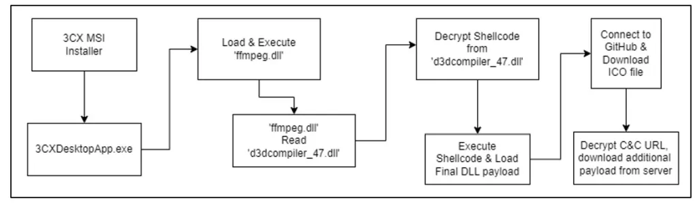
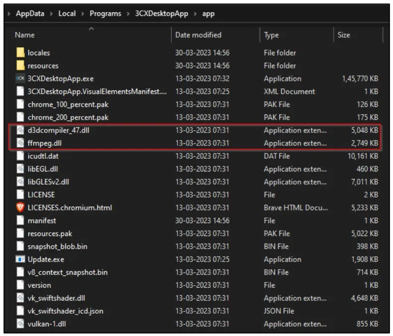
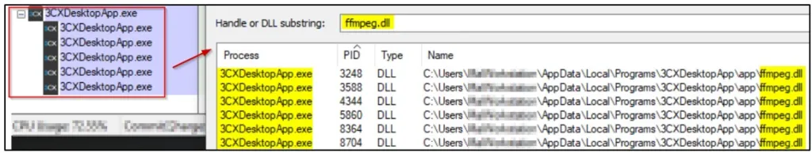
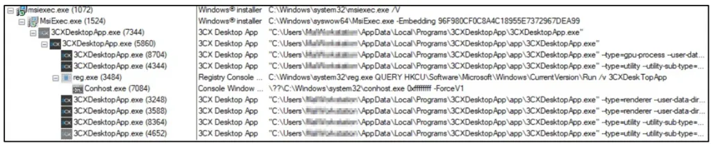
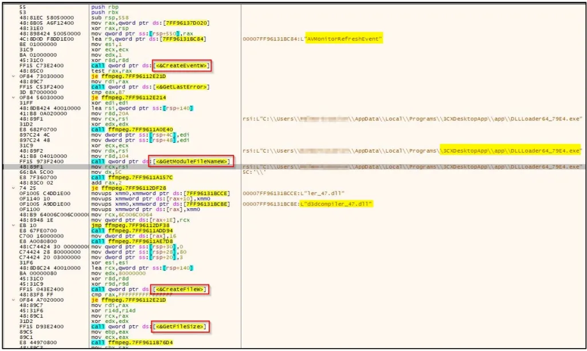
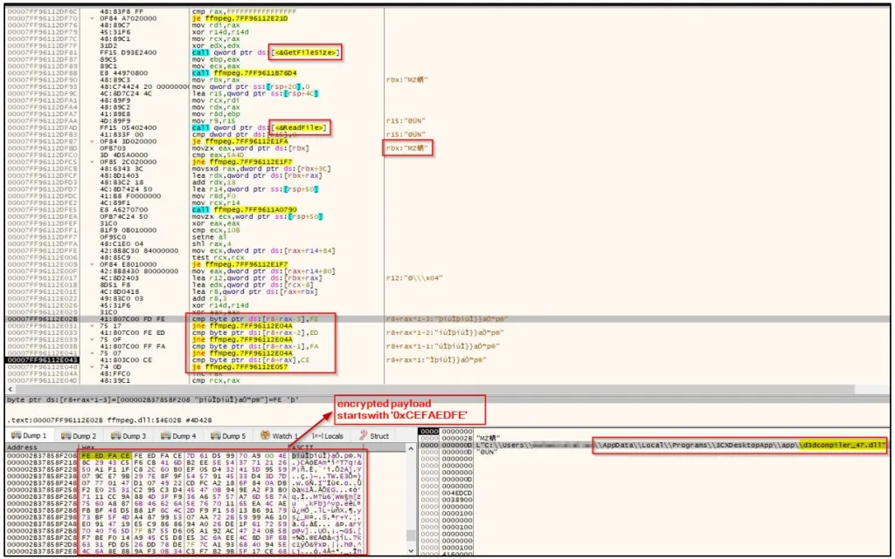
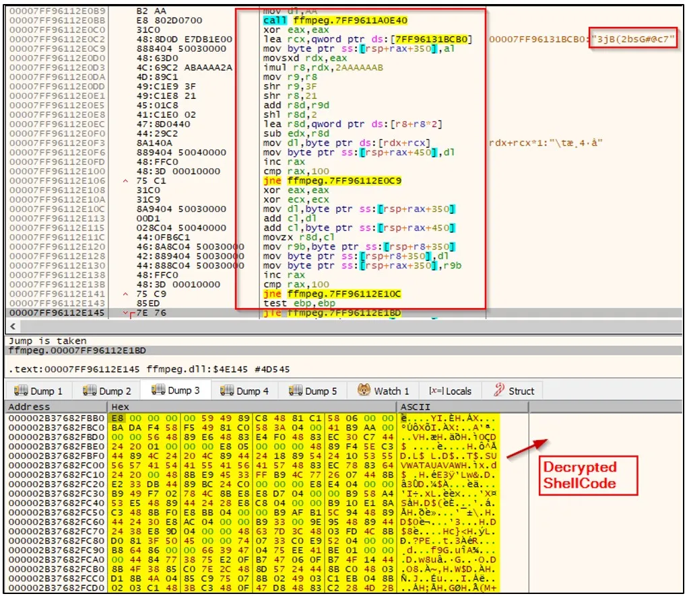
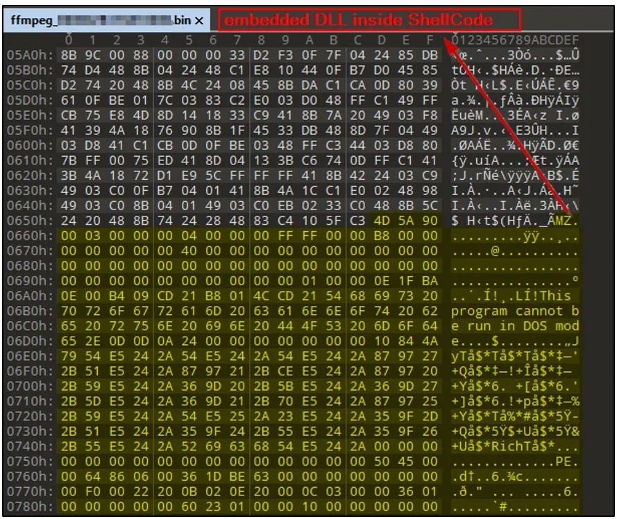
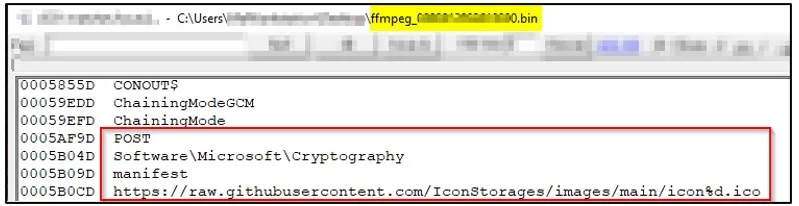
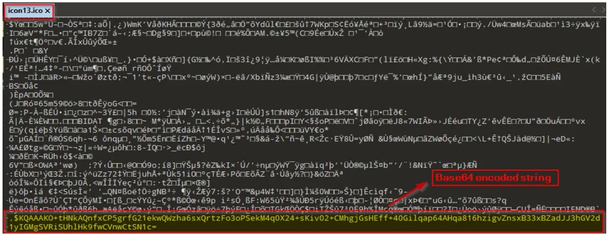

Le fichier .msi, lorsqu'il est exécuté, dépose deux fichiers malveillants - "ffmpeg.dll" et "d3dcompiler_47.dll" - à l'emplacement C:\Users[user_name]\AppData\Local\Programmes\3CXDesktopApp\.

L'infection commence lorsque le fichier "3CXDesktopApp.exe" charge la DLL "ffmpeg.dll". Ensuite, "ffmpeg.dll" décrypte le code crypté de "d3dcompiler_47.dll", qui semble être un shellcode.

Ce shellcode charge un autre fichier DLL qui tente d'accéder à la page GitHub d'IconStorages pour trouver un fichier .ico contenant le serveur de commande et de contrôle (C&C) chiffré. Après avoir localisé le serveur C&C, la porte dérobée établit une connexion pour récupérer la charge utile finale potentielle.

La capture ci-dessous illustre le flux d'infection.

*capture 1 - Chaîne d'infection*

### Analyse technique

Le programme d'installation du paquet MSI qui a été compromis possède une signature numérique et son apparence ressemble à celle d'un fichier légitime, comme le montre la capture ci-dessous.

*capture 2 - Programme d'installation MSI portant une signature numérique*

Lors de l'installation, le programme d'installation MSI dépose des fichiers tels que "3CXDesktopApp.exe", "ffmpeg.dll" et "d3dcompiler_47.dll" dans le répertoire %LocalAppData% du système.

*%LocalAppData%\NProgrammes\NCXDesktopApp\Napplication*

Ces fichiers sont associés à un comportement malveillant et sont accompagnés d'autres fichiers de soutien.

La capture ci-dessous montre le répertoire dans lequel l'application "3CXDesktopApp" a été installée.

*capture 3 - Dossier d'installation de 3CXDesktop*

Après l'installation, le fichier "3CXDesktopApp.exe" est exécuté, ce qui est généralement bénin mais peut être utilisé pour charger la DLL malveillante, comme indiqué ci-dessous.

*capture 4 - 3CXDesktop.exe chargeant le fichier ffmpeg.dll*

La capture ci-dessous illustre l'arborescence des processus de l'application "3CXDesktopApp".

*capture 5 - Arbre de processus*

L'application "3CXDesktopApp.exe" charge le fichier "ffmpeg.dll", qui est une DLL malveillante spécialement conçue pour lire, charger et exécuter un shellcode nuisible à partir du fichier "d3dcompiler_47.dll".

Lorsqu'il est exécuté, le fichier "ffmpeg.dll" crée un nouvel événement, "AVMonitorRefreshEvent", identifie le chemin d'accès au fichier actuel et recherche le fichier suivant dans la séquence, à savoir "d3dcompiler_47.dll". Une fois identifié, "ffmpeg.dll" charge le fichier "d3dcompiler_47.dll" en mémoire, comme l'illustre le code d'assemblage ci-dessous.

*capture 6 - Le fichier ffmpeg.dll charge d3dcompiler_47.dll*

Bien que le fichier chargé "d3dcompiler_47.dll" soit signé par Microsoft, il contient une charge utile chiffrée. Le fichier "ffmpeg.dll" identifie maintenant la charge utile chiffrée indiquée par un marqueur particulier, "0xCEFAEDFE", comme le montre la capture ci-dessous.

*capture 7 - Identification de la charge utile chiffrée dans "d3dcompiler_47.dll "*

Une fois la charge utile cryptée identifiée, "ffmpeg.dll" procède au décryptage du flux RC4 à l'aide de la clé "3jB(2bsG#@c7". Ce processus de décryptage aboutit à un shellcode qui est ensuite exécuté par le fichier DLL.

La capture ci-dessous montre la boucle RC4 et la fonction shellcode décryptée.

*capture 8 - Boucle RC4 et shellcode décrypté*

Après le décryptage, le fichier "ffmpeg.dll" utilise la fonction VirtualProtect() pour modifier les autorisations d'accès à la mémoire du shellcode. Une fois les autorisations modifiées, le logiciel malveillant procède à l'exécution de la charge utile.

Un fichier DLL intégré est présent dans le shellcode décrypté, comme le montre la capture ci-dessous, et semble fonctionner comme un chargeur pour un autre fichier PE.

*capture 9 - Fichier DLL intégré dans le shellcode*

Après avoir été chargé et exécuté, le fichier DLL intégré dans le shellcode se met en veille pendant 7 jours avant d'essayer d'établir une communication avec les serveurs de commande et de contrôle (C&C). Ensuite, la DLL tente d'accéder à un dépôt GitHub contenant un fichier .ICO.

*capture 10 - Lien GitHub codé en dur pour télécharger le fichier .ICO*

Ce fichier ICO comprend les chaînes C&C cryptées, qui sont encodées à l'aide de Base64 et cryptées avec AES et GCM. Le contenu Base64 se trouve à la fin du fichier image ICO, comme indiqué ci-dessous.

*capture 11 - Chaîne codée en Base64 à la fin du fichier ICO*

Lors de son exécution, le fichier DLL décrypte les URL C&C des fichiers ICO pour télécharger des charges utiles supplémentaires à partir du serveur distant. Pour obtenir des URL C&C distinctes, le logiciel malveillant sélectionne au hasard un fichier ICO à partir d'un dépôt GitHub.
